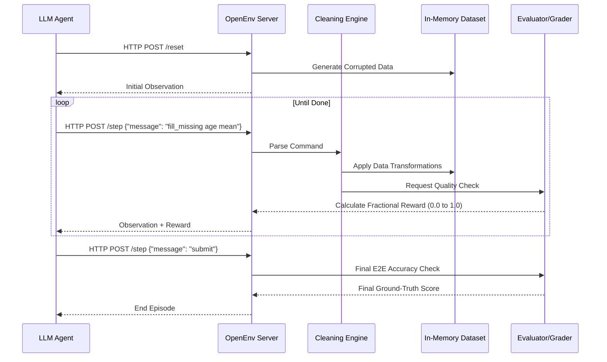

# DataWranglerEnv — Data Quality & Cleaning Environment


An [OpenEnv](https://github.com/meta-pytorch/OpenEnv)-compliant environment where AI agents act as data analysts fixing messy real-world datasets.

Data cleaning consumes **60-80% of data scientists' time** in practice. This environment simulates the exact workflow: profile data → diagnose issues → apply targeted fixes → validate results. Agents are scored on a multi-dimensional quality metric against known ground truth.

---


## Architecture Workflow



## Environment Description

The agent receives a messy dataset and must clean it using text commands. Each episode:

1. **Reset** — A fresh dirty dataset is generated (seeded for reproducibility)
2. **Explore** — Agent profiles the data to understand its issues
3. **Diagnose** — Agent finds missing values, duplicates, outliers, type errors
4. **Clean** — Agent applies targeted fixes (fill missing, remove dupes, fix types, etc.)
5. **Submit** — Agent finalizes, gets a quality score against ground truth

### Why Data Cleaning?

- ✅ **Real-world task** that data scientists do every day
- ✅ **Multi-step reasoning** — must diagnose before fixing
- ✅ **Partial progress** — each fix incrementally improves the score
- ✅ **Anti-exploit design** — destructive "shortcuts" are penalized
- ✅ **Novel domain** — no existing OpenEnv covers data wrangling

---

## Tasks

| Task | Dataset | Rows | Cols | Issues | Max Steps |
|------|---------|------|------|--------|-----------|
| `task_1_easy` | Customer Records | 50 | 5 | Missing values, duplicates, city typos | 30 |
| `task_2_medium` | Sales Transactions | 200 | 8 | + Type errors, date inconsistencies, outliers, negative values | 50 |
| `task_3_hard` | Healthcare Records | 1000 | 12 | + Fuzzy duplicates, cross-column logic errors, impossible values, category inconsistencies | 80 |

### Expected Baseline Scores

| Task | Score Range |
|------|------------|
| `task_1_easy` | 0.75 – 0.90 |
| `task_2_medium` | 0.55 – 0.75 |
| `task_3_hard` | 0.30 – 0.55 |

---

## ️ Action Space

**`DataWranglerAction(message: str)`** — A single text command string.

### Available Commands

| Command | Usage | Description |
|---------|-------|-------------|
| `help` | `help` | List all commands |
| `view` | `view [N]` | Show first N rows (default 10) |
| `profile` | `profile` | Dataset summary: shape, dtypes, missing %, duplicates |
| `profile_column` | `profile_column age` | Detailed stats for one column |
| `find_missing` | `find_missing` | Missing value counts per column |
| `find_duplicates` | `find_duplicates [col1,col2]` | Find duplicate rows |
| `find_outliers` | `find_outliers price` | IQR-based outlier detection |
| `fill_missing` | `fill_missing col strategy [value]` | Fill nulls (`mean`/`median`/`mode`/`constant`/`forward_fill`) |
| `remove_duplicates` | `remove_duplicates [cols] [keep]` | Drop duplicates (`first`/`last`/`none`) |
| `fix_dtype` | `fix_dtype col type` | Cast column (`int`/`float`/`str`/`datetime`) |
| `replace` | `replace col "old" "new"` | Find and replace values |
| `standardize` | `standardize col method` | Normalize (`lowercase`/`uppercase`/`titlecase`/`strip`) |
| `remove_rows` | `remove_rows col condition value` | Filter rows (`equals`/`less_than`/`greater_than`/`contains`) |
| `clip` | `clip col lower upper` | Clip numeric values to bounds |
| `validate` | `validate` | Check current quality score |
| `submit` | `submit` | Finalize and grade (ends episode) |

---

## ️ Observation Space

**`DataWranglerObservation`** — Structured response with metadata.

| Field | Type | Description |
|-------|------|-------------|
| `response` | `str` | Text result of the command |
| `dataset_shape` | `str` | e.g. `"50 rows × 5 columns"` |
| `current_score` | `float` | Current quality score (0.0–1.0) |
| `step_number` | `int` | Current step in the episode |
| `max_steps` | `int` | Maximum allowed steps |
| `task_name` | `str` | Active task identifier |
| `available_commands` | `str` | Help text |
| `done` | `bool` | Whether episode is over |
| `reward` | `float` | Step reward |

---

## Reward Function

**Multi-dimensional, trajectory-level signal** (not sparse binary):

### Per-Step Rewards
- **Diagnostic commands** (`profile`, `find_missing`, etc.): +0.02
- **Successful cleaning operations**: +0.03 to +0.15 (proportional to improvement)
- **Destructive actions** (lost good data): -0.05 to -0.20
- **No-effect commands**: -0.01
- **`validate`**: +0.01 (first 5 times)
- **`submit`**: Final quality score as reward

### Final Score Dimensions
| Dimension | Weight | Measurement |
|-----------|--------|-------------|
| Missing values fixed | 25% | Reduction in null cells |
| Duplicates removed | 20% | Reduction in duplicate rows |
| Type correctness | 20% | Columns matching expected dtypes |
| Value accuracy | 25% | Cell-by-cell match with ground truth |
| Data preservation | 10% | Penalty for losing valid rows |

---

## Setup & Usage

### Prerequisites
- Python >= 3.10
- Docker (for containerized execution)

### Install
```bash
cd data_wrangler_env
pip install -e .
```

### Run Locally
```bash
# Start the server
uv run server

# Or with uvicorn directly
uvicorn server.app:app --host 0.0.0.0 --port 8000
```

### Docker
```bash
# Build
docker build -t data-wrangler-env -f server/Dockerfile .

# Run
docker run -p 8000:8000 data-wrangler-env
```

### Run Inference
```bash
export API_BASE_URL="https://api.openai.com/v1"
export MODEL_NAME="gpt-4o-mini"
export HF_TOKEN="your-api-key"
python inference.py
```

### Client Usage
```python
from data_wrangler_env import DataWranglerEnv, DataWranglerAction

with DataWranglerEnv(base_url="http://localhost:8000").sync() as client:
    result = client.reset(task="task_1_easy", seed=42)
    print(result.observation.response)

    result = client.step(DataWranglerAction(message="profile"))
    print(result.observation.response)

    result = client.step(DataWranglerAction(message="find_missing"))
    print(result.observation.response)

    result = client.step(DataWranglerAction(message="fill_missing age mean"))
    print(result.observation.response, result.reward)

    result = client.step(DataWranglerAction(message="submit"))
    print(f"Final score: {result.observation.current_score}")
```

---

## Project Structure

```
data_wrangler_env/
├── __init__.py                       # Package exports
├── models.py                         # Pydantic Action/Observation models
├── client.py                         # EnvClient subclass
├── openenv.yaml                      # OpenEnv manifest
├── pyproject.toml                    # Dependencies
├── server/
│   ├── app.py                        # FastAPI app
│   ├── data_wrangler_env_environment.py  # Core environment logic
│   ├── dataset_generator.py          # Synthetic dataset generation
│   ├── cleaning_engine.py            # Command parser + operations
│   ├── grader.py                     # Multi-dimensional scoring
│   ├── Dockerfile                    # Container image
│   └── requirements.txt             # Server dependencies
inference.py                          # Baseline inference script (project root)
```

---

## Design Decisions

1. **Text command interface**: Agent sends simple text strings — more natural for LLMs than structured JSON actions
2. **Seeded generation**: `random.Random(seed)` ensures identical datasets across runs
3. **Progressive difficulty**: Easy→Medium→Hard introduces qualitatively different error types, not just more rows
4. **Anti-exploit**: Dropping all rows removes duplicates but destroys data → penalized
5. **Multi-dimensional grading**: 5 orthogonal quality dimensions prevent gaming any single metric

---

## License

BSD-3-Clause — see [LICENSE](LICENSE)
